# Packet Analysis Lab

Hands-on packet analysis with **tcpdump** and **Wireshark**, built in my home lab while I was learning both tools.

I captured traffic between two lab hosts and worked through it in three stages: normal traffic, troubleshooting, and a couple of controlled "suspicious" patterns. The question I was trying to answer:

> Can I capture traffic, explain what the network is doing, recognize when behavior is abnormal, and support conclusions with packet-level evidence?

The goal was not to label every anomaly as malicious. It was to understand what the packets actually support.

## Skills Demonstrated

Reading tcpdump and Wireshark output, explaining ARP, ICMP, TCP, DNS, and SSH behavior from it, telling open, closed, and filtered ports apart on the wire, and keeping conclusions within what the packets show.

## Results at a Glance

| Section | Test | What the packets showed |
|---|---|---|
| [1](#1-arp-and-icmp-baseline) | Fedora pings its gateway | 4 request/reply pairs, ICMP id 27787; the gateway sent its own ARP requests for Fedora |
| [2](#2-tcp-three-way-handshake-over-ssh) | SSH handshake | SYN, SYN/ACK acknowledging the client's sequence number plus one, ACK |
| [3](#3-routed-layer-2-vs-layer-3-behavior) | Routed SSH frame | Ethernet header rewritten for the last hop; source and destination IPs unchanged; TTL 127, consistent with one routed hop from an initial 128 |
| [4](#4-ssh-metadata-and-encryption) | SSH key exchange | Version banners and algorithm offers readable; negotiated `curve25519-sha256` and `chacha20-poly1305` |
| [5](#5-dns-failure-queries-without-responses) | DNS failure | Same query 3 times, 5 seconds apart, no reply. The cause, found later, was a typo in the DHCP-assigned resolver |
| [6](#6-working-dns-query-and-response) | Working DNS lookup for reference | Query and response with matching transaction ID `0x0002`, 8 A records, DNS TTL 235 seconds |
| [7](#7-open-closed-and-filtered-tcp-states) | Open, closed, dropped port | SYN/ACK; RST/ACK; SYN retries at about 1, 2, 4, and 8 seconds |
| [8](#8-controlled-reconnaissance-pattern) | 11-port probe in about 5 seconds | 1 open, 2 reset, 8 no response |
| [9](#9-controlled-periodic-beacon-like-traffic) | HTTP every 10 seconds | Gaps of 10.033 to 10.050 seconds, average about 10.04 |

---

## Lab Context

| System | Role | Address |
|---|---|---|
| Windows 11 workstation (Victus) | Wireshark analysis / traffic generation | 10.10.20.102 |
| Fedora host (ENVY, hostname `fedora`) | tcpdump capture / target host | 10.10.30.100 |
| ER605 | Routing between the two lab networks / policy boundary | 10.10.20.1 / 10.10.30.1 |
| Lab LAN (VLAN 1) | Windows workstation's lab network | 10.10.20.0/24 |
| VLAN 30 (intended protected segment) | Fedora host's network | 10.10.30.0/24 |

Both machines were also connected to the household network over Wi-Fi during this lab. The Windows workstation was 192.168.1.18 on that network and used it for normal internet access, which is where the working DNS capture in section 6 came from. Because Fedora was dual-homed too, it wasn't actually isolated behind the ER605 at the time. VLAN 30 was meant to be a protected segment, but the Wi-Fi connection gave Fedora a second path that didn't go through it. I found and fixed that afterward: Fedora's Wi-Fi was turned off and the enclave was re-tested in [prove-it NET-008](https://github.com/RobertMyersCloud/prove-it/blob/main/01-networking/NET-008-protected-systems-enclave/README.md#re-test-and-fixes--october-5-2026).

Raw PCAP files are retained locally and excluded from the public repository. Public evidence uses sanitized screenshots.

---

# Part 1 — Network Fundamentals

## 1. ARP and ICMP Baseline

The first capture was taken on Fedora while it pinged its gateway, the ER605 at 10.10.30.1.

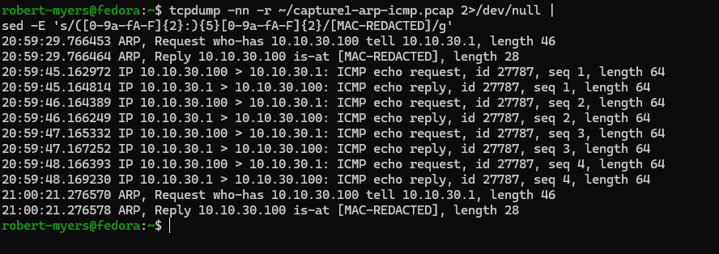

What the capture shows:

- At 20:59:29 the **gateway** sent an ARP request, `who-has 10.10.30.100 tell 10.10.30.1`, and Fedora replied with its MAC. That was about 15 seconds before the first ping, and the same exchange repeated at 21:00:21. That looks like the router re-checking its entry for Fedora, though the capture doesn't show why it sent them. It wasn't Fedora resolving the gateway before the ping.
- Fedora never sent an ARP request for 10.10.30.1 in this capture, which is consistent with it already having the gateway's MAC in its neighbor cache.
- Four echo requests and four replies followed, about one second apart, all with ICMP id 27787 and sequence numbers 1 through 4.

Background on what these fields mean:

- ARP resolves an IPv4 address to a Layer 2 MAC address on the local broadcast domain.
- The ARP cache and the switch CAM/MAC table are different:
  - ARP maps **IP address → MAC address**.
  - A switch CAM table maps **MAC address → switch port**.
- ICMP echo requests and replies can be paired by identifier and sequence number.
- The identifier helps associate packets with the same echo session/process.
- The sequence number distinguishes individual requests within that session.

Wireshark showed the same ICMP exchange in a more visual form.

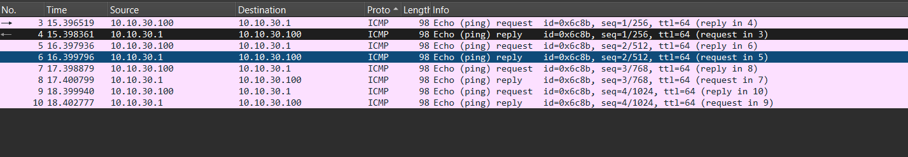

Wireshark shows the identifier in hex (`id=0x6c8b`, which is 27787) and pairs each request with its reply. The four request/reply pairs have matching sequence numbers and a TTL of 64.

---

## 2. TCP Three-Way Handshake over SSH

I captured a fresh SSH session from Windows to Fedora with tcpdump.

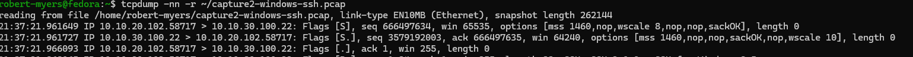

The connection began with:

```text
10.10.20.102.58717 > 10.10.30.100.22   [S]   seq 666497634
10.10.30.100.22 > 10.10.20.102.58717   [S.]  seq 3579192003, ack 666497635
10.10.20.102.58717 > 10.10.30.100.22   [.]   ack 1
```

What this shows:

- The Windows client used ephemeral source port 58717. Fedora listened on TCP/22.
- The SYN consumes one sequence number: Fedora acknowledged 666497635, one more than the client's SYN sequence number.
- Each side has its own independent sequence space (666497634 for the client, 3579192003 for Fedora).
- After the handshake, tcpdump switches to relative numbers (`ack 1` on the third line). Wireshark does the same by default, which makes the stream easier to follow than raw 32-bit values.

---

## 3. Routed Layer 2 vs Layer 3 Behavior

Frame 7 of the same SSH capture shows what routing changes and what it doesn't. The Ethernet header is rewritten for the last hop, and the source and destination IP addresses stay the same. The TTL drops by one, and the router recalculates the IP header checksum to match.

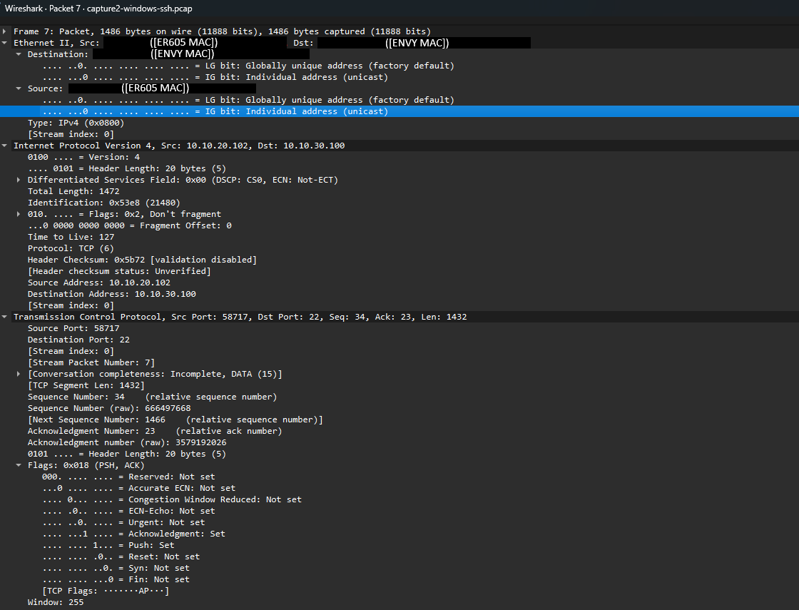

The packet showed:

```text
Layer 2:
ER605 MAC -> ENVY (Fedora) MAC

Layer 3:
10.10.20.102 -> 10.10.30.100

TCP:
58717 -> 22
```

Because Windows and Fedora were on different subnets, the ER605 routed the packet into the Fedora network. This frame was captured on the destination side, so it shows the last hop only: the Ethernet addresses are the ER605's and Fedora's, while the IP addresses are still the original Windows source and Fedora destination.

The captured packet also showed a TTL of 127, consistent with a packet that likely started at a common Windows default of 128 and crossed one routed hop.

---

## 4. SSH Metadata and Encryption

Screenshot 05 is the Windows client's Key Exchange Init (KEXINIT) message. It lists the algorithms the client **offered**, in order of preference:

- key exchange (`curve25519-sha256` first)
- host-key types
- encryption, for each direction (`chacha20-poly1305@openssh.com` first)
- MAC/integrity
- compression (`none,zlib@openssh.com,zlib`)

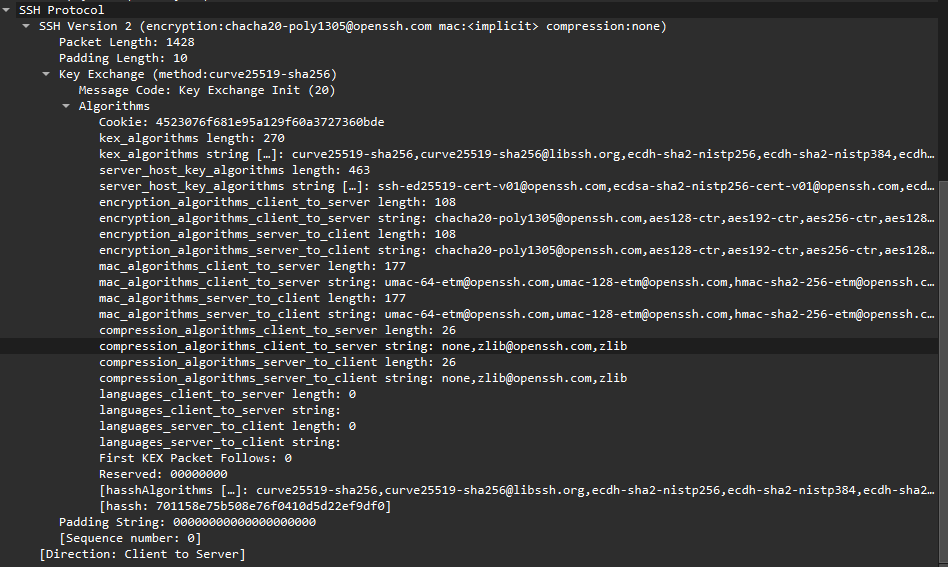

These lists are offers, not the result. The negotiated values come from comparing the client's lists with the server's. Wireshark does that comparison once it has seen both KEXINIT messages and shows the outcome on the summary lines: `Key Exchange (method:curve25519-sha256)` and `encryption:chacha20-poly1305@openssh.com mac:<implicit> compression:none`. The MAC shows as implicit because chacha20-poly1305 provides its own integrity check.

The Follow TCP Stream view shows both version banners in plain text:

- client (red): `SSH-2.0-OpenSSH_for_Windows_9.5`
- server (blue): `SSH-2.0-OpenSSH_10.2`

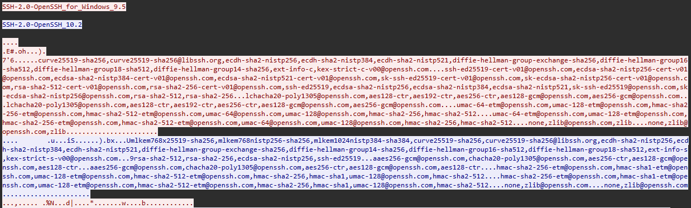

Both KEXINIT algorithm lists follow, also readable. The server's key-exchange list starts with `mlkem768x25519-sha256`, but the client's full list doesn't include it, so it couldn't be chosen. The first client preference the server also supports, `curve25519-sha256`, matches what Wireshark reports in screenshot 05. After key exchange finishes (NEWKEYS), the rest of the stream is encrypted and shows up as unreadable bytes.

Follow TCP Stream rebuilds the byte stream. It doesn't decrypt an SSH session.

Even with encryption, I could still see endpoints, ports, timing, packet sizes, TCP state, software versions, the offered and negotiated algorithms, and traffic direction.

---

# Part 2 — Troubleshooting

## 5. DNS Failure: Queries Without Responses

Fedora sent DNS queries that never received a response.

> **Correction (October 5, 2026):** This section originally attributed the failure to lab policy blocking the upstream path. That was wrong. The resolver `10.10.31.1` is not on any lab subnet; it was a typo in the ER605's VLAN30 DHCP pool (the gateway is `10.10.30.1`). The capture below is unchanged. Only the explanation was corrected. Root cause, fix, and validation are documented in [prove-it NET-008, Finding 1](https://github.com/RobertMyersCloud/prove-it/blob/main/01-networking/NET-008-protected-systems-enclave/README.md#re-test-and-fixes--october-5-2026).

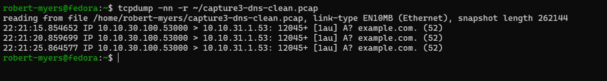

The capture showed the same DNS query sent three times, five seconds apart, with the same transaction ID (12045) and the same source port:

```text
10.10.30.100.53000 > 10.10.31.1.53: 12045+ [1au] A? example.com.
```

with no response packets.

What the capture shows:

- Fedora sent well-formed DNS queries for `example.com` to 10.10.31.1
- the same transaction was retried, unchanged
- no responses appear in the captured traffic

The capture was taken on Fedora itself, so it shows the queries were sent, not that they left the host or reached the network. The capture interface and the route Fedora used toward 10.10.31.1 aren't shown.

I didn't capture the command that generated these queries.

What it did **not** prove was *why* nothing answered. Silent retries look the same whether a firewall drops the query or the resolver address doesn't exist. Checking the client's configured resolver (`resolvectl status`) and where it came from (`nmcli -f DHCP4 device show`) would have separated those two causes before a conclusion was drawn.

**Outcome:** I later traced the address to its source. The ER605's VLAN 30 DHCP pool was handing out `10.10.31.1` as the DNS server, a typo for the gateway `10.10.30.1`. After I corrected it, `resolvectl query` resolved names through the lab interface. Details and evidence are in [prove-it NET-008, Finding 1](https://github.com/RobertMyersCloud/prove-it/blob/main/01-networking/NET-008-protected-systems-enclave/README.md#re-test-and-fixes--october-5-2026).

---

## 6. Working DNS Query and Response

For reference, this is a working DNS exchange. It is not a controlled comparison with section 5: it's a different host (Victus, on household Wi-Fi as 192.168.1.18), a different resolver (`1.1.1.1`), a different name, and a different network.

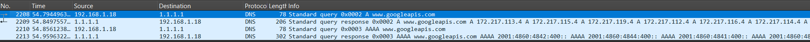

The A query for `www.googleapis.com` went out with transaction ID `0x0002`, and the response came back with the same ID. An AAAA query (`0x0003`) followed the same way.

The detailed response showed the DNS answer structure.

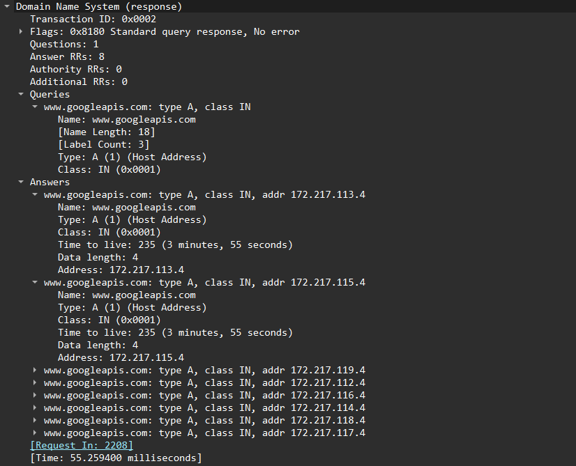

The response included:

- flags `0x8180`: standard query response, no error
- 1 question, 8 answer records
- each answer: Type A, Class IN, an IPv4 address
- DNS TTL of 235 seconds (3 minutes, 55 seconds)
- response time of about 55 ms after the request

| Field | Purpose |
|---|---|
| IP TTL | Limits how many routed hops a packet can cross |
| DNS TTL | Controls how long a DNS answer can be cached |

---

## 7. Open, Closed, and Filtered TCP States

### Open port

The working SSH service on TCP/22 showed (section 2):

```text
SYN -> SYN/ACK -> ACK
```

Interpretation: host reachable, service listening, TCP connection established.

### Closed port

A connection attempt from Windows to TCP/65000 on Fedora was answered immediately with a reset. In Fedora's capture, the RST/ACK went out less than a millisecond after the SYN, acknowledging 1898909320 (the SYN's sequence number plus one).

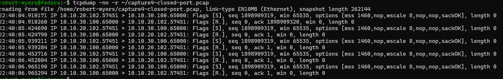

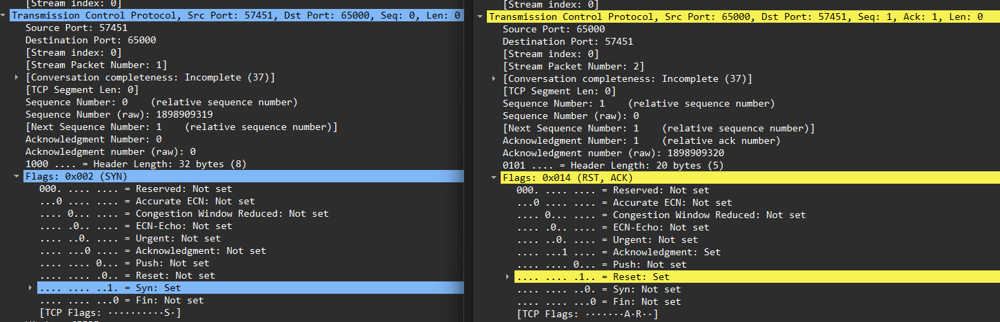

Pattern:

```text
SYN -> RST/ACK
```

Windows retried after each RST. The capture shows five SYNs from the same source port (57451) with the same sequence number, about 0.5 seconds apart, and every one was answered with an RST.

Interpretation: the target host was reachable, and the port answered with a reset. That's how a port with no listener normally responds. A firewall can also send resets, and I didn't capture the listener state, so the packets alone don't prove which.

### Filtered / dropped port

I added a temporary host firewall drop rule on Fedora for TCP/65001. The rule command isn't shown in the screenshots.

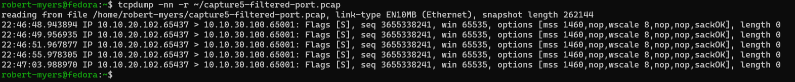

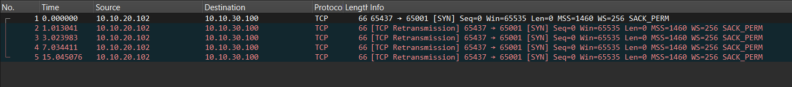

Pattern:

```text
SYN -> no response
SYN retransmission (~1 s later) -> no response
SYN retransmission (~2 s later) -> no response
SYN retransmission (~4 s later) -> no response
SYN retransmission (~8 s later) -> no response
```

The gap doubled each time: about 1, 2, 4, and 8 seconds. That's TCP exponential backoff.

This capture was taken on Fedora, the target. tcpdump sees inbound packets before the host firewall acts on them, so the SYNs showing up here means they made it across the network to Fedora. What the packets show: the SYNs arrived and nothing answered. What I set up: a drop rule for this port. Together those point to the host firewall, but the rule and its counters aren't in the evidence.

| State | Packet Pattern | Likely Interpretation |
|---|---|---|
| Open | SYN → SYN/ACK → ACK | Host reachable, service listening |
| Closed | SYN → RST/ACK | Host reachable; consistent with no listener (a firewall can also send resets) |
| Filtered / dropped | SYN → retries → silence | Traffic dropped by a firewall or lost on the path. In this lab the SYNs reached Fedora; no response was captured, consistent with the configured host drop rule |

---

# Part 3 — Security Analysis

## 8. Controlled Reconnaissance Pattern

A bounded test from Windows sent connection attempts to 11 ports on Fedora, about 0.5 seconds apart, over roughly 5 seconds. The command that generated it isn't shown.

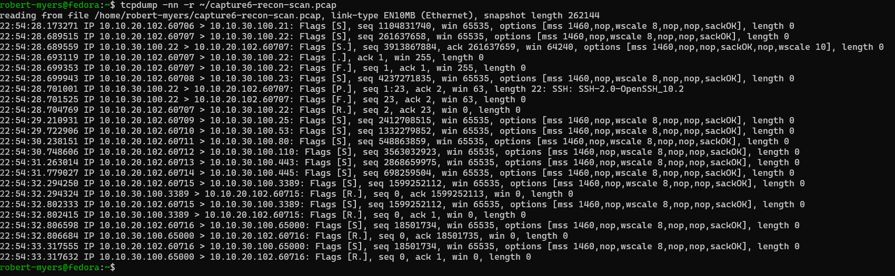

Ports probed:

```text
21, 22, 23, 25, 53, 80, 110, 443, 445, 3389, 65000
```

Results from the capture:

| Port | Response in capture | Reading |
|---|---|---|
| 22 | SYN/ACK; the client completed the handshake and closed right away (the server's `SSH-2.0-OpenSSH_10.2` banner appears before the client's reset) | Open |
| 3389 | RST/ACK (SYN sent twice, RST both times) | Closed |
| 65000 | RST/ACK (SYN sent twice, RST both times) | Closed |
| 21, 23, 25, 53, 80, 110, 443, 445 | One SYN each, no reply | No response observed; consistent with filtering |

3389 and 65000 answered with RST, which is how a port with no listener normally responds. The other eight got no reply at all. I didn't capture the firewall configuration, the listener state, or the capture command (screenshot 14 is a read-back of the saved file), so I can't rule out that ICMP rejections were left out of the capture. This table is what the packets show, not an explanation of the rule set.

In Wireshark I filtered on the SYN flag, which also shows SYN/ACKs. Frame 3 is Fedora's SYN/ACK from port 22. The filter bar isn't in the screenshot.

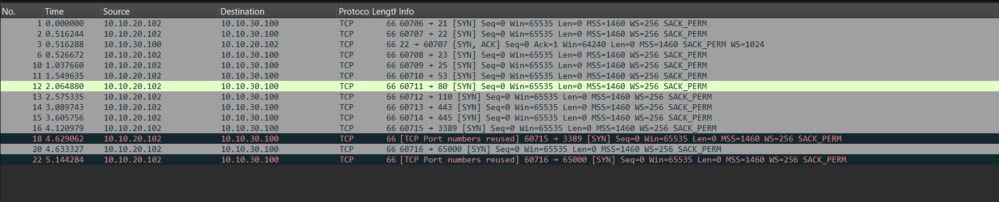

Wireshark also marked the second attempts to 3389 and 65000 as `[TCP Port numbers reused]`, because Windows retried from the same source port.

What made the activity stand out was the behavior:

```text
one source
+
one target
+
many destination ports
+
about 5 seconds
```

The observed pattern was **consistent with reconnaissance or port enumeration**.

It was not treated as proof of malicious intent or compromise.

---

## 9. Controlled Periodic Beacon-Like Traffic

I ran a temporary HTTP service on Fedora on TCP/65002, and the Windows host requested it repeatedly at about ten-second intervals. The command that started the server and the client-side loop aren't shown in the screenshots.

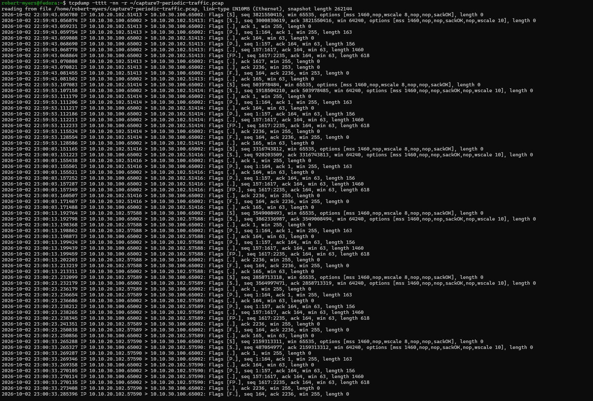

The tcpdump screenshot (captured 2026-10-02) shows six connections. Their SYN times:

```text
22:59:43.056780
22:59:53.107083
23:00:03.151165
23:00:13.192764
23:00:23.232099
23:00:33.265288
```

The gaps were 10.050, 10.044, 10.042, 10.039, and 10.033 seconds, an average of about 10.04 seconds. The sixth connection is cut off at the bottom of the screenshot after its FIN.

The Wireshark screenshot covers the same capture from the start: four complete bursts and the SYN of the fifth at 40.175 seconds.

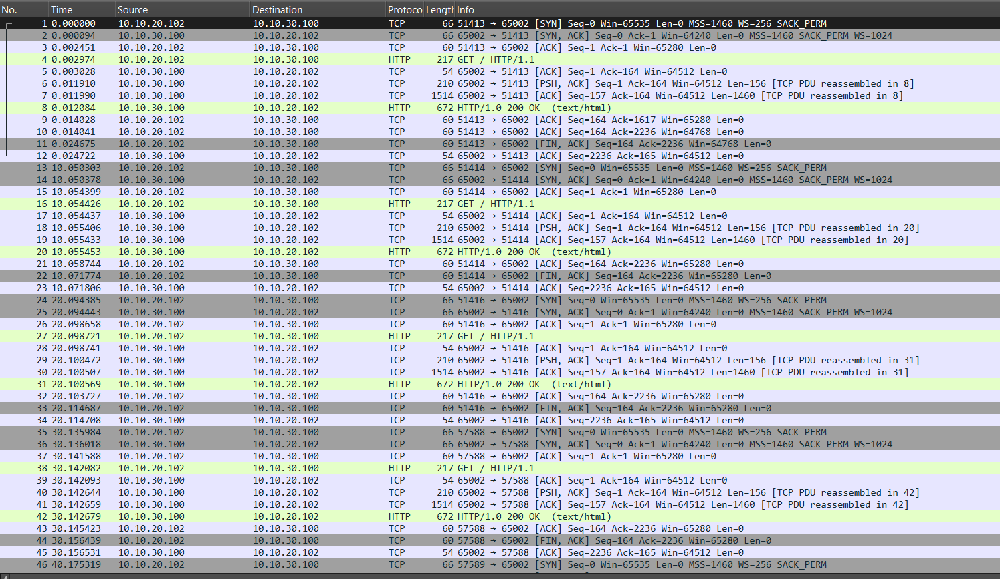

Each burst included:

- TCP handshake from a new ephemeral port
- `GET / HTTP/1.1` from Windows
- `HTTP/1.0 200 OK (text/html)` from Fedora
- connection teardown: the server's FIN rides on its last data segment (`[FP.]` in screenshot 16; Wireshark labels that frame `HTTP/1.0 200 OK`), and the client sends its own FIN

Consistent periodic communication can be an indicator of beacon-like behavior.

However:

> Periodicity alone is not proof of command-and-control activity.

Legitimate systems can also communicate at regular intervals, including monitoring agents, health checks, scheduled jobs, polling applications, and management tools.

---

# Analysis Workflow

```text
Capture
  ↓
Identify endpoints
  ↓
Identify protocol / ports
  ↓
Establish normal behavior
  ↓
Find deviation
  ↓
Measure timing / repetition / responses
  ↓
Form a packet-supported conclusion
  ↓
State what the evidence does NOT prove
```

Packet analysis can identify strong indicators and narrow an investigation, but a suspicious pattern should not automatically be presented as proof of compromise.

---

# Tools Used

- **tcpdump** (on Fedora)
  - reading saved captures with `-r`
  - `-nn` to skip name and port resolution
  - `-tttt` for full date and time stamps (section 9)
  - piping output through `sed` to redact MAC addresses (section 1)

- **Wireshark** (on Windows)
  - display filters
  - packet list and packet details
  - TCP sequence/acknowledgment and flag fields
  - DNS and SSH dissection
  - Follow TCP Stream
  - retransmission and port-reuse markers
  - relative timestamps for timing

The capture commands and the PowerShell traffic generators aren't shown in the screenshots. A bounded live capture with the full command and its packet counts is shown in [prove-it NET-002](https://github.com/RobertMyersCloud/prove-it/blob/main/01-networking/NET-002-tcp-udp-traffic-analysis/README.md#bounded-capture).

---

# Key Takeaways

1. **Packet capture separates symptoms from causes.**  
   A failed connection can mean a silent firewall drop, a closed port, or a path problem. Those look different on the wire, and where the capture was taken matters for which one you can rule out.

2. **tcpdump and Wireshark serve different purposes.**  
   tcpdump gave me fast text output from the saved captures. Wireshark made fields, flags, and patterns easier to inspect.

3. **Layer 2 and Layer 3 tell different parts of the path.**  
   Routed packets keep their Layer 3 endpoints while the Ethernet header changes for the local hop.

4. **Encryption does not eliminate metadata.**  
   SSH protects the session contents, but endpoints, timing, sizes, software versions, and the key-exchange offers are visible.

5. **Patterns matter more than isolated packets.**  
   One SYN is normal. One source probing many ports in a few seconds is more interesting. Repeated connections every 10 seconds are more interesting. Context decides whether those are expected or suspicious.

6. **An indicator is not the same thing as proof.**  
   Recon-like and beacon-like traffic should trigger investigation, not automatic claims of compromise.

---

# Evidence Index

| # | Evidence |
|---|---|
| 01 | [tcpdump ARP and ICMP capture](evidence/01-tcpdump-arp-icmp-capture.png) |
| 02 | [Wireshark ICMP baseline](evidence/02-wireshark-icmp-baseline.png) |
| 03 | [tcpdump SSH three-way handshake](evidence/03-tcpdump-ssh-three-way-handshake.png) |
| 04 | [Wireshark routed SSH frame](evidence/04-wireshark-routed-ssh-frame.png) |
| 05 | [Wireshark SSH metadata and encryption](evidence/05-wireshark-ssh-metadata-and-encryption.png) |
| 06 | [Wireshark Follow TCP Stream SSH](evidence/06-wireshark-follow-tcp-stream-ssh.png) |
| 07 | [tcpdump unanswered DNS retries](evidence/07-tcpdump-dns-unanswered-retries.png) |
| 08 | [Wireshark working DNS query and response](evidence/08-wireshark-dns-working-query-response.png) |
| 09 | [Wireshark DNS response details](evidence/09-wireshark-dns-response-details.png) |
| 10 | [tcpdump closed-port RST](evidence/10-tcpdump-closed-port-rst.png) |
| 11 | [Wireshark closed-port RST](evidence/11-wireshark-closed-port-rst.png) |
| 12 | [tcpdump filtered-port timeout](evidence/12-tcpdump-filtered-port-timeout.png) |
| 13 | [Wireshark filtered-port retransmissions](evidence/13-wireshark-filtered-port-retransmissions.png) |
| 14 | [tcpdump controlled recon pattern](evidence/14-tcpdump-controlled-recon-pattern.png) |
| 15 | [Wireshark controlled recon SYN pattern](evidence/15-wireshark-controlled-recon-syn-pattern.png) |
| 16 | [tcpdump periodic traffic pattern](evidence/16-tcpdump-periodic-traffic-pattern.png) |
| 17 | [Wireshark periodic beacon-like pattern](evidence/17-wireshark-periodic-beacon-like-pattern.png) |

---

# Public Evidence and Sanitization

The public repository contains screenshots rather than raw packet captures.

Raw PCAP files are intentionally retained locally and excluded through `.gitignore`.

Before publication, screenshots were reviewed to remove or avoid:

- MAC addresses where unnecessary
- credentials
- passwords
- private keys
- authentication tokens
- unrelated browsing history
- unnecessary system identifiers

RFC1918 lab IP addresses, test ports, protocol metadata, and controlled test traffic remain visible because they are necessary to explain the network behavior demonstrated by the project.

---

# What I Check First Now

The corrections in this lab changed what I verify before drawing a conclusion:

- every interface and route on the hosts involved (`ip -br link`, `ip route`), so a second path can't hide
- where a resolver address actually comes from (`resolvectl status`, the DHCP options, the server's pool), not just whether queries are answered
- where the capture was taken and what its filter could have left out
- the configuration behind an observation, such as a firewall rule and its counters, before naming the cause

---

# Revision Notes

**October 5, 2026:** I re-checked each section against its screenshots and corrected several descriptions: who sent the ARP request (section 1), what the SSH screenshot shows (section 4), what the DNS capture point proves (section 5), where the filtered-port drop happened (section 7), and the full probe results (section 8). The screenshots are unchanged.

**October 6, 2026:** Tightened wording where the text claimed more than the packets show: what routing changes in the IP header (section 3), closed and unanswered ports (sections 7 and 8), the filtered-port conclusion (section 7), and the ARP and DNS inferences (sections 1 and 5). Pointed the section 9 teardown to the server's `[FP.]` segments in screenshot 16. Added a results table. Later the same day: linked the results table to each section, brought the DNS outcome into section 5, and added what I check first now.

---

# Status

**Complete.** Screenshot-based analysis of saved captures. Limits: the capture commands, traffic-generation commands, and firewall rules aren't shown, and Fedora was dual-homed on household Wi-Fi during the lab, so it wasn't isolated.
